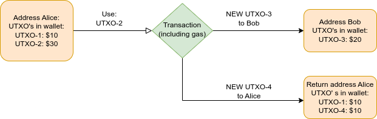

# Cardano practicum
Welcome to the world of blockchain development! This repository plays a vital role in understanding and harnessing the potential of blockchain technology This course is designed for the minor Blockchain at the Amsterdam University of Applied Science.

This Project is focused on understanding the basics of Cardano and setting up the basic development environment for Building 
Dapps on the Cardano network using the [Mesh library](https://meshjs.dev/).  This is a library that allows you to use functions that interact with the Cardano blockchain.

 # Course Content

Throughout the duration of this course, a branch will be created for each week. These branches will contain assignments and associated files, facilitating your learning journey.

# Learning objectives
* Understanding the Cardano network and capabilities 
* Setting up development environment
* Build simple webserver, connect wallet & check balance

# Prerequisites
* IDE installed - (visual studio code is used in this project)
* Webwallet installed in browser (Nami is used in this project)
* Optional: Watch [Cardano overview by Charles Hoskinson](https://youtu.be/Ja9D0kpksxw)

# Understanding the Cardano network and capabilities
Cardano is a Proof-of-stake type of blockchain network. It is designed for the unbanked in this world.
Where as most transactions are handled by banks,
 Blockchain allows us to do transactions (digital consensus) without the help of a third party.
 The blockchain network is the 'third party' and in Cardano's case it is fully open-source,
 so everyone is able to check what is going on on the background.
The Cardano network is based on the extended version of bitcoin's UTXO model,
 thanks to this Cardano is able to execute smart contracts. Down below E-UTXO will be explained.

## E-UTXO
E-UTXO is stands for 'extended unspend transaction output'.
 This protocol is designed to also make smart contracts possible on the Cardano network, 
Bitcoin only allows simple transactions. Ethereum, Polkadot and Solana do not have (E-)UTXO's they use an account based system. 
To simplify both systems both models will be explained in the pictures down below.

### Account based transaction
In this system transactions are made by signing a transaction with your private key and updating the balance of the address on the network.
A transaction like this looks like the following image:   


This is a straight forward transaction, but if you have to deal with millions of transactions you have to be careful with the following.
Let's say Alice only has \$10 dollar in her account, she has gotten $30 dollars from someone else and then want to do this transaction above in the same block.
It could happen that the order of transactions could be processed wrong. This will result in an error, because at the time of transacting \$20 dollars to bob,
Alice only has \$10 dollars. (error: insufficient balance) By having to sort the order of transactions it could bottleneck the blockchain network in scaling. (resulting in slow/ expensive transactions)
Another problem that could occur with this system is double transactions. If there is any bug in an application used by Alice she could for example pay bob twice \$20 dollars.
This is possible, because the only thing that is needed for this transaction is a signing from a user's private key.


### (E-)UTXO based transaction

This type of transaction is a bit difficult to understand. Instead of having a balance that is being updated after each transaction, the transaction is made up with UTXO's.
(Unspend transaction outputs) This UTXO is comparable with regular cash. See an UTXO as a dollar bill, every dollar bill is unique and you cannot split it.
The difference beteween a dollar bill and a UTXO is that a UTXO can only be used once, where as a dollar bill can be used again. 
Within the transaction new UTXO's will be generated. Let's illustrate a transaction down below: 



In this transaction, you see that Alice uses her \$30 utxo (bill) to pay Bob \$20 dollar. The transaction is signed with Alice's private key. Her \$30 dollar utxo is split in 2 new UTXO's one \$20 dollar & one \$10 dollar UTXO.
Both of these UTXO's are newly generated with help of her public key. The return address can be different than the address she used before. How?
Since Alice generated a new UTXO from the transaction for herself with her public key, The address where the UTXO is linked to can only be used by her private key.
This makes sure only Alice could use this UTXO. Having multiple addresses helps with privacy! This is better than using the same account over and over again.
Next to this, the gas fees can be determined before doing the transaction, How? That is because all the in's and out's of the transaction are already known.
With an account based system, you do not know before the transaction in what order it goes and if the transaction could result in an error.
In this example no balance's need to be updated on-chain. Next to this the transaction order in a block doesn't matter.
That's because all the in and outputs are known. If you do not have the UTXO's to pay for a transaction there is no transaction possible.
This model also makes it possible to transact in parallel, since there is no balance to update. You could just say: use UTXO-1 for x transaction and use UTXO-2 for y transaction.
the outputs are not interrupting each other. Further explanation of the extended version of the UTXO model comes later in the course.

### Sources:
* https://jcliff.medium.com/intro-to-blockchain-utxo-vs-account-based-89b9a01cd4f5
* https://blockonomi.com/utxo-vs-account-based-transaction-models/
* https://docs.cardano.org/learn/eutxo-explainer
* https://youtu.be/mtlwffigI5k
* https://youtu.be/HT6_j_ZyAms

# Setup of development enviroment
To setup your development enviroment you need to have an IDE installed. if not installed install [nodejs](https://nodejs.org/en/). Simply download 'recommended for most users'
version and run the executable to get nodejs installed. 

check your node version in you cmd with:
```
 node -v
```
if your node version is below v16.16.0 then consider updating it by doing: 
```
 npm install npm@latest -g
```


Next install one of the following wallets if not done yet: 

 

[nami](https://namiwallet.io/) is simple and straight forward to use.


# Build simple webserver, connect wallet & check balance/ assets
Now it's time to build something yourself! Go over to [Mesh](https://meshjs.dev/guides/nextjs) and follow the tutorial.
It might occur that the layout appears strange. If so copy the styles folder from /Dapp/styles from this repository.


Make sure your wallet's network is set to "preprod" See instructions down below:

step 1: go to settings by clicking on the image in the top right corner.


Step 2: select network and choose Preprod.


Step 3: configure [testnet page](https://docs.cardano.org/cardano-testnet/tools/faucet) like this and request funds. In less than a min it should be in your wallet. Now refresh your Dapp and check your balance! 


To actually see if your balance will change in your webapp we can do a test transaction and check the output of the transaction
First Go to: [this link](https://meshjs.dev/apis/transaction). And try and connect your wallet with your own address as recipient! Or send some test ada to your friend who skipped the step of requesting test ada ;) 

 on the [Cardano PreProd testnet explorer](https://preprod.cardanoscan.io/) you can see all kinds of info about your transaction. Now let's check one of your transactions!

For the details of your transaction click on the transaction id.

 

As you can see under 'UTXOs' the transaction uses inputs and outputs. The inputs are a wallet addres and a hash that verifies the transaction. (made from the private key of the owner)
the outputs are 2 wallets. 1: the return addr of the sender and the addr of the receiver. This transaction sends 10 test ADA to the receiver by using a 4,992.
827193 UTXO. The output of this is 2 new UTXO's. One 10 ada UTXO for the receiver and one 4,982.
6587 UTXO to the return addres. Just as described under "E-UTXO" of this file.
 

After doing this practicum we understand how UTXO's are working and how account based models are more sensitive for errors. Also we learned how a transaction is build on Cardano.
Next to this we learned how to setup the development enviroment and how to connect a wallet to a webapp! If there is any feedback or questions about this practicum feel free to e-mail:
renze.goossens@hva.nl or your current teacher :)


