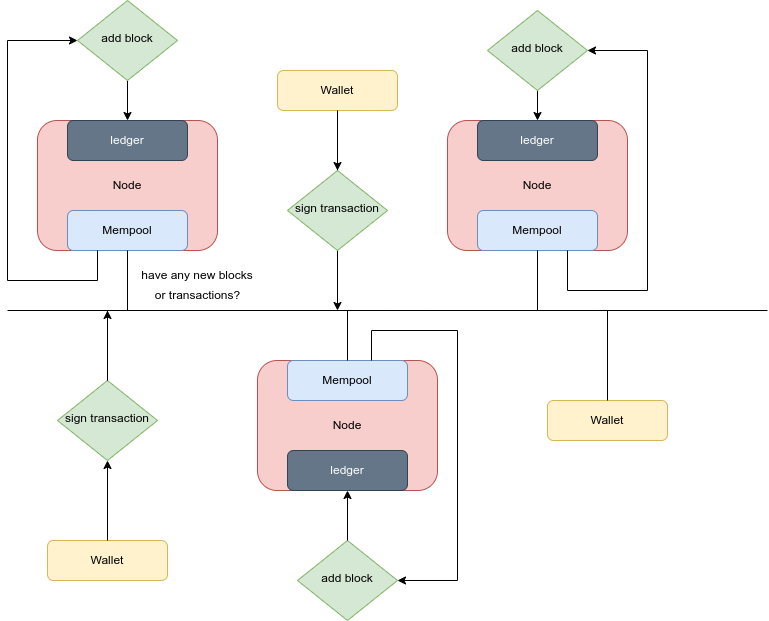
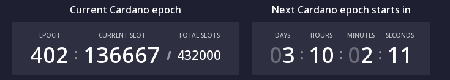

# Cardano practicum 2

In this practicum we will take a look back at week one and add some more theory to it. Next to this we also continue working with the Mesh library.

## Learning objectives
* What is a Cardano wallet.
* Understand how blocks are created.     
* Know what slots and epochs are.
* Be able to build a transaction within webapp.

## Prerequisites

* week1 finished
* pre-knowledge on [public & private key mechanism](https://youtu.be/AQDCe585Lnc)

## What is a Cardano wallet

Crypto wallets can be found in multiple forms: paper, hardware, online, desktop and even as a mobile wallet.
All of them have one thing in common. All forms are able to store the public and private key of the owner.
The cryptocurrency itself is not stored on a wallet. Cryptocurrency is assigned to an address and this is stored on
a distributed ledger. This means that the blockchain network keeps track of where the currency is stored.
Your wallet only stores the public and private key to sign transactions that allows you to move your cryptocurrency
from one address to one another. They always say: 'not your keys, not your coins'. This means that if you do not have
the keys to make a transaction then the cryptocurrency does not belong to you. Why do they say this?
That is because most of us do not know that having cryptocurrency in your exchange's account means that
the company owns your crypto and not you. Example's of exchange's are: FTX, Binance, Bitvavo. Example's of wallets are:
Metamask, Nami, Daedalus or even Trezor.

## How are blocks created

First of all "The goal of blockchain technology is the production of an independently-verifiable and cryptographically-linked chain of records (blocks)."
This means nothing more than: a block is a set of transactions grouped together and linked to it's previous block. The blockchain has a start of course.
The first block in the chain is called the 'genesis' block. From there on new blocks are added just like how a linked-list works.

Now that we know how blocks are made and how transactions work we can go over to how blocks are added to the chain.
For this we need to understand all parts of the process. We have: wallets, nodes, mempool & ledger.

* wallet: contains keys to spent utxo's
* Node: Runs software to keep track of transactions/ blocks and is able to add blocks to chain. (
is also able to make any transactions)
* mempool: storage place on the node for new transactions that need to be added to block.
* ledger: storage place on the node for storing all the blocks in the network.

Oke now let's have a look at a diagram to get a overview of what is going on.



The blockchain network is based on a pull-based system. So all the nodes in the network are continuously asking the network (other nodes to who they are connected)
"hey got any new transactions for my mempool?" Or "hey got any new blocks to add to my ledger?".
In this way every node can keep up with the network at it's own pace.

now if we would go from transaction to block the following is happening:

1. Wallet signs a transaction
2. transaction is propagated to other nodes their mempool.
3. when mempool is full enough a node makes a block out of x amount of transactions.
4. Block is propagated to other nodes.
5. Other nodes verify the block and add the new block to their ledger.
6. tx's in added block are removed from mempool's over the network.

Now we have a got a 'simple' overview of how blocks are added to the network. If still unclear,
have a look at this [video](https://youtu.be/K7c-5S-23dg)

## Slots and epochs

Bitcoin's proof of work allows the node that solves a cryptographic puzzle as first to add a block to the network.
This results in nodes having to use a lot of energy to be the first one to solve this puzzle. Next to this it results in centralization,
because the people who own the most powerfull computers will have them located at places where energy & cooling is cheap.
Also regular computers can't compete with the dedicated mining farms. 
Cardano's proof of stake mechanism allows everyone to add blocks on the chain, based on the amount of stake they have.

This is where Slots and epochs come in to play. Every epoch has 432000 slots. Every slot is 1 second so an epoch is 5 days.
Within every slot zero or more 'block producing nodes' are nominated to be slot leader. (not every node is set up to produce blocks)
All the nominated nodes make a block, only the slot leader is allowed to add the block to the network. The other nodes will discard their block and take over the block of the slot leader.

The slot leader is elected based on their stake. Stake is the amount of currency you have delegated to a stake pool. Compare it with a lottery,
The slot leader is randomly chosen, but the more tickets (stake) you have the higher the chance is that you get elected.

Note: nodes that have too much stake are saturated, this means that the chance of getting elected to be slot leader is at it's max. "you are only allowed to have this much tickets to the lottery,
if you buy any more it won't result in a bigger chance". This ensures that pools aren't getting to big, because that would mean they are missing out on getting rewards.




## sources:
* https://docs.cardano.org/new-to-cardano/types-of-wallets
* https://developers.cardano.org/docs/stake-pool-course/introduction-to-cardano/#how-are-new-blocks-produced
* https://medium.com/viper-stake-pool/expected-blocks-per-epoch-17dad48721ff
* https://www.adatainment.com/_downloads/docs/delegation_design_spec.pdf
* https://youtu.be/2Sz9crZkjCY


## build transaction in your webapp

In week one we learned what a transaction is and how utxo's work compared to account based systems. In week two we learned what a wallet is and how transactions are added to the blockchain.
Now it is time to build some transactions within your Dapp.

**Note: you can only continue from here if you passed week 1.**

The following steps will be:

- Add textboxes for user input

- Store state of textbox

- Build transaction

- Send transaction with error handling

- Convert ADA to Lovelace

- Use button to make transaction

### 1. Add textboxes for user input

So first of all we need inputs from the user, from last week the user was able  to connect to our Dapp. 
Now we want the user to fill in the wallet address and the amount of ADA that needs to be transferred.
Next to this in the third form we want the output of the transaction (transaction hash) This can be used
to check your transaction on: https://preprod.cardanoscan.io/

go to your **index.tsx** file and add 3 forms (html elements) just like this:

```
		<form>
          <label>send Ada to:
            <input
              type="text" 
              value={WalletAddress}
              onChange={(e) => setAddress(e.target.value)}
            />
          </label>
        </form>

        <form>
          <label>amount of ADA:
            <input
              type="text" 
              value={txAmount}
              onChange={(e) => setTxAmount(e.target.value)}
            />
          </label>
        </form>

        <form>
          <label>Transaction hash:
            <input
              type="text" 
              value={lastTx}
            />
          </label>
        </form>

```

as you can see all the forms have a 'value' this value needs to be stored and updated when ever the user input changes.
The last form has no 'onchange' option, that is because there is no reason for the user to change the output. 

### 2. Store state of textbox

in step 1 we saw that the forms have types, values and onchange attributes. To actually store
these inputs from the user we define constants with a state that can be updated. This will look
like: 

```
// set string constants that change state when text in textbox is adjusted
  const [lastTx, setLastTx] = useState("");
  const [WalletAddress, setAddress] = useState("");
  const [txAmount, setTxAmount] = useState("");
```
if we break down a line of code here you see for example: 'const [lastTx, setLastTx] = useState("");

const stand for constant, because the the constant value of 'lastTx' is a 'state'.
[lastTx, setLastTx] are the  'getters and setters' of the state of the constant. 'useState("")' is the
function that keeps track of the state of the constant.

### 3. Build transaction

now that we have everything ready to build a transaction 'input- and outputfields' & the storage of data we can build a transaction.
The Mesh library we are using already did a lot for us. Have a look at: their [example](https://meshjs.dev/apis/transaction)

We are going to make functions out of their example like this:

```
// Build transaction, includes : wallet address & amount of money. (returns a type 'Promise<string>' )
  async function buildTx(walletAdr: string, amount: string): Promise<string>{
    const tx = new Transaction({ initiator: wallet })
    .sendLovelace(
      walletAdr,
      amount
    )
  ;
  const buildedTx = await tx.build();
  return buildedTx;
  }
```
the input parameters are the wallet address & the amount of money, the output is a promise string. This string is the result after building.
The walletAdr & amount are used in the function **.sendLovelace();** Just like bitcoin has 'satoshi' Cardano
ADA has Lovelace. **1 ADA is 1.000.000 Lovelace** (one million). After the transaction is build it is returned as result of the function. Keep in mind that 999978 Lovelace(+ transaction fees)
is the minimum to spend when making a transaction. (to prevent DOS attacks)

### 4. Send transaction with error handling

the function to send your Transaction will have a try & catch to prevent your Dapp from crashing when for example: a transaction gets canceled.
The function will look like: 

```
// send transaction, parameters: 'Promise<string>' from buildTx() Note: sets state of lastTX (maby make it return the hash of tx) 
  async function sendTx(buildedTx: Promise<string>){
    try{
      const unsignedTx = await buildedTx;
      const signedTx = await wallet.signTx(unsignedTx);
      const txHash = await wallet.submitTx(signedTx);
      setLastTx(txHash);
      return txHash;
    }catch(e: any){
      console.log(e.name);
      console.log(e.message);
    }
  }
```

As you can see the input is the Promise<string> and what happens is you await the string that was the result of the build.
Next the transaction needs to be signed by you entering your spending password.
Then when everything is ready the 'signedTx' is submitted and propagated to the network! The 'lastTx' constant state value is then updated
with the resulting hash from the transaction. If anything goes wrong, the error is catched and logged to the console in your webbrowser. (click f12 to see)

### 5. Convert ADA to Lovelace

since the Mesh library did not have a sendAda function it is handy to convert ADA to lovelace.
Then the user can just enter the amount of ada he want to spend instead of having to type out all the lovelaces...
When you hover over the .sendLovelace() function in buildTx() you can see
that the parameters are both strings. So first we need to convert the amount of ada from the textfield to a number.
(you can't really do calculations with strings) Then make it Times 1 million and convert it back to a string. Easy right? well it looks like this:

```
function adaToLovelace(amount: string): string{
    var tempVal: number = +amount;
    tempVal = tempVal * 1000000;
    console.log(tempVal);
    var value: string = tempVal.toString();
    return value;
  }
```
### 6. Use button to make transaction

The last thing to do is to reuse our button we used to getAssets from. It will look like this:

```
<h1>Connect Wallet</h1>
        <CardanoWallet />
        {connected && (
            <>
              <h1>Make transaction!</h1>
              {assets ? (
                  <pre>
              <code className="language-js">
                {JSON.stringify(assets, null, 2)}
              </code>
            </pre>
              ) : (
                  <button
                      type="button"
                      onClick={() => sendTx(buildTx(WalletAddress, adaToLovelace(txAmount)))                    }
                      disabled={loading}
                      style={{
                        margin: "18px",
                        backgroundColor: loading ? "orange" : "grey",
                      }}
                  >
                    Make transaction!
                  </button>
              )}
            </>
        )}

```

Adjust the text to your likings and make sure the button's onClick attribute is set like this:

```
onClick={() => sendTx(buildTx(WalletAddress, adaToLovelace(txAmount)))
```

If still having any problems take a look at Week2/Dapp/pages/index.tsx


