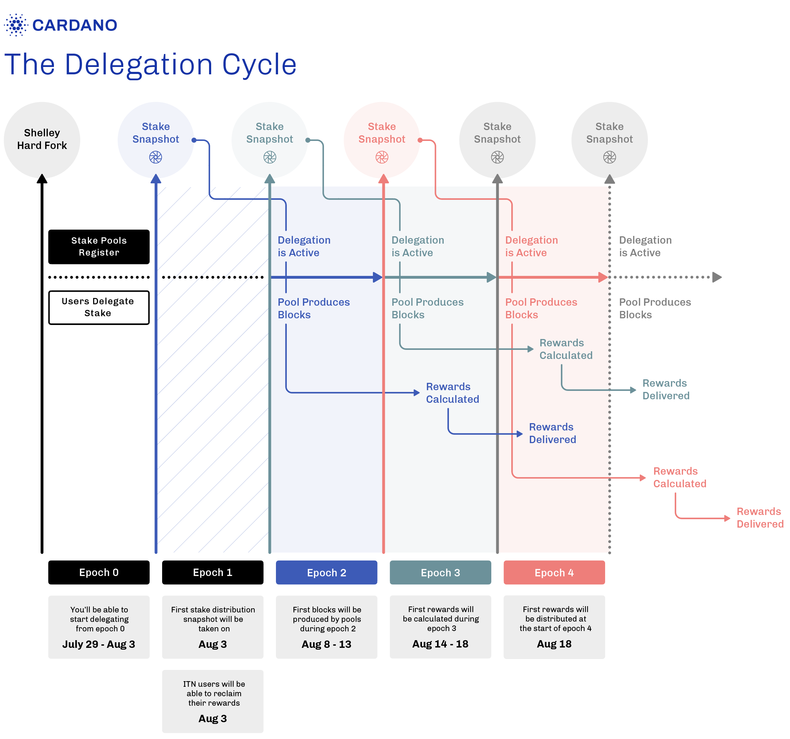

# Cardano practicum 3

In this practicum we will take a look back at week two and add some more theory to it. Next to this we also continue working with the Mesh library.

## Learning objectives
* Know what staking is
* Learn how to stake and how rewards are distributed  
* Add metadata to transaction
* Build transactions with time limits

## Prerequisites

* week2 finished


## What is staking?

Being a stakeholder/ shareholder it means that you own a part of a company or asset. 
As a investor you want a return on your investment. When you hold a share of a company for example,
the company will share/ pay you a part of their profits. This as a return for your investment in their company.

If we look at a more common example we can look at our bank account. You (the investor) keeps money at the bank.
This means your bank is allowed to invest this money and make returns on it. For you being loyal to your bank and having
your money in the bank, the bank will return you interest over the time you have a certain amount in your bank account.
When The bank goes bankrupt your money is most likely to be gone, except if the government intervenes.

In the world of blockchain there is something called 'staking'. If you hold some cryptocurrency you will be rewarded for holding it.
If people like to hold crypto then the asset gets scarce that will result in some sort of value. Bitcoin does not have any options for staking.
Blockchains like: Ethereum, Polkadot, Solana & Cardano do have this option.

When we compare the staking mechanisms Cardano outstands Ethereum and Polkadot. Why? Cardano is the only blockchain,
at this moment that does not require you to 'lock' your tokens to receive your rewards.

Locking your tokens means that you agree to lock up your crypto in a contract over x amount of time.
After  this you should get your rewards. At the moment of writing, Ethereum does still not have a working solution to pay out
rewards from staked Eth. (11-04-2023)

If you want your crypto to have value it needs to have some scarcity, by locking crypto it gets scarce ofcourse. 
Then how does Cardano have staking without locking up your tokens?

Last week slots & epochs were discussed. The more stake a pool had the more chance it got in getting elected as slot leader.
Having a certain amount of ADA results in having a certain amount of 'tickets' to participate in the lottery.

Every wallet can set up a second pair of spending keys. 
This results in having your regular spending keys and your spending keys for your stake address.
A regular address looks like:

`addr1qygfhyfjgl5ppv7fmrpyps77367wsegvzcc83u7ka7gvrn3v2gxhase5u7hvvzdkf8yc8ckuwefjdgftqpvcanqdwlcsvdl0g4`

And a stake address looks like: 

`stake1uyk9yrt7cv6w0tkxpxmynjvrutw8v5ex5y4sqkvwesxh0ug7prc4k` 

Why have a separate address for staking? Well this is where UTXO's and account based systems come back.
The stake address is an account based system. So for regular wallets we have UTXO's to spend and for staking we use accounts?
The simple answer is: 'yes'.

Most of the time when rewards get's distributed, the amount of ADA that you receive is not worth the minimum spending amount of a transaction.
(Minimum spending is 1 ADA exc. transaction fees (DOS attack prevetion) this small amount is called 'dust'.
It is important to have everyone included in staking to secure the network. This is why the balance of a stake address gets updated by the network.
The small addresses get their staking rewards and after a period of time it is a normal amount of ADA. Otherwise staking would not be interesting for addresses with a small amount of ADA.

When you make a transaction most wallet apps will include your staking rewards in the transaction, making the balance zero again of your reward address.
This is nice, because in this way you do not have to pay extra transaction fees for sending the rewards to your address.

**Note**: Stake addresses are account-based, you cannot send UTXO's to it. The only Risks that are involved in staking on Cardano,
is not receiving your rewards. (caused by bad performance of stake pool) **For staking on Cardano you do not need to send any ADA to an address**

After all this text let's have a look at a overview of how staking rewards are distributed.

## How to stake & how are rewards distributed



Let's follow the blue line in this overview. This 'line' is cyclic and starts every epoch again.

**epoch 0**

Here you see the 'shelley hardfork' this was an 'upgrade' that made staking possible on the mainnet.
In this epoch 0 new pools have been made and wallets delegated their 'stake' (provide tickets for winning slot leader lottery)

**epoch 1**

In this epoch the first 'snapshot' of the balances of delegated addresses is taken. This snapshot determines how many 'tickets' you delegate to your pool.

**epoch 2**

In epoch 2, your stake is actually active and allows stake pools to produce blocks (of course if elected as slot leader)

**epoch 3**

After an epoch of producing blocks the rewards are being calculated, not yet distributed.

**epoch 4**

In this last epoch of this cycle the rewards are delivered to the stake addresses of the delegators.


### sources:
* https://forum.cardano.org/t/the-shelley-hard-fork-all-you-need-to-know/36553
* https://www.adatainment.com/_downloads/docs/delegation_design_spec.pdf


## Add metadata to transaction

What is metadata, and why would you include it in a transaction? Metadata is 'data' (information) about data. Got it?
So for example when you have a picture of Bob, this picture could be seen as 'data'. The metadata about this picture could be:
hair color of bob or his length. Or even when the picture is created/ where it can be found.

Metadata is usefull as it comes to sorting datasets based on their properties. Lets say you are a company accepting crypto.
The metadata of all the transactions could tell how much your revenue was on a particular day. 
In short: Metadata allows you to define transactions more precisely in order to sort and group them.

to add data to a transaction we can use the Mesh library function called **setMetadata();** This funciton will take 2 arguments.
a key number and metadata. This could be just one string, but most common is to add metadata in .json format as second argument.
The **buildTx()** could look like this:

```
// metadata only used as example
  var metadata = {
    "orderNr": "069", 
    "customerNr": "420024", 
    "employeeId": "2072",
    "comments": "No pickles on the burger please",
    "date": "01/04/2030",
    "carbonCreditCost": "201"
    };
  // Build transaction, includes : wallet address, amount of money, metadata & expire time of tx. (metadata & exptime optional) (returns a type 'Transaction' )
  async function buildTx(walletAdr: string, amount: string, metadata?: any): Promise<string>{
    const tx = new Transaction({ initiator: wallet })
    .sendLovelace(
      walletAdr,
      amount
    );

    if(metadata){
      tx.setMetadata(0, metadata);
    }else{
      console.log("no metadata");
    }
    
    const unsignedTx = await tx.build();
    return unsignedTx;
  }
```

This simple function allows you to add a lot of data in each transaction! But be careful, you might forget that the blockchain is public.
For this reason try to encrypt all sensitive data like: full names, passwords and addresses. it's best ofcourse to encrypt everything :) 

## Build transactions with time limits

Now let's say you have a business that has to pay a lot of invoices each day. For every invoice there is a time limit
to pay the amount of money. As a business you want to plan when this invoice will be paid. We could say we make a buffer with transactions.
each transaction gets a time to start limit so payment does not get paid too early. (due to staking rewards)
When we do this we can line up transactions to be automatically paid when ready. 

For this we need 2 things. First we need to determine at what time we want the transaction to be able to execute.
Second we want to add this time slot to our transaction.

**1. Convert time to slot**

This function resolves the slot that we want after x amount of minutes we fill in.
Later we can use this slot to set our timetostart for our transaction.

```
import { resolveSlotNo } from '@meshsdk/core';

//Gets slot number of preproduction testnet, inputs: minutes (fill in 0 for current slot nr)
  function getSlotNr(minutes: number): string{
    let nowDateTime = new Date();
    const slot1 = resolveSlotNo('preprod', nowDateTime.getTime());
    console.log("huidige slot: " + slot1);
    let dateTimeAdded = new Date(nowDateTime.getTime() + minutes*60000); //600000 is for converting minutes to miliseconds.
    console.log(dateTimeAdded);
    const slot = resolveSlotNo('preprod', dateTimeAdded.getTime());
    console.log((nowDateTime.getUTCHours() + 2) + ":" + nowDateTime.getUTCMinutes()); // +2 is for conversion to local time Utrecht Netherlands
    console.log("slot number =" + slot);
    return slot;
  }
```

**2. Add timeToStart() to transaction**

This is your build function but with an extra parameter: 'startSlot'. The '?' behind the parameter is to make it optional.


```
// Build transaction, includes : wallet address, amount of money, metadata & start time of tx. (metadata & exptime optional) (returns a type 'Transaction' )
  async function buildTx(walletAdr: string, amount: string, metadata?: any, startSlot?: string): Promise<string>{
    const tx = new Transaction({ initiator: wallet })
    .sendLovelace(
      walletAdr,
      amount
    );

    if(metadata){
      tx.setMetadata(0, metadata);
    }else{
      console.log("no metadata");
    }
    
    if(startSlot){
      tx.setTimeToStart(startSlot);
      console.log("transaction should be executable after slot: " + startSlot)
    }else{
      console.log("no timer");
    }
    
    const unsignedTx = await tx.build();
    return unsignedTx;
  }
```


**How to test this timeToStart() function?**

for the transaction to go invalid before the start time we need to build the transaction first. (otherwise the timetostart parameter is not set)
We make 3 buttons, build, send & get slot number. You know how to add buttons to your Dapp so go ahead. Make sure for the onclick function for the build button that you store the result so you could make the send button use it later. ).
Still confused have a look at: Week3/Dapp/pages/index.tsx (starting at line: 150)


After finishing all this work we now can say that we know what staking is, what the benefits are & how its better on Cardano than other blockchains.
We also did some programming with metadata and slots have come to play again.
Congratulations you now are understanding the basics of Cardano and how to work with mesh!


