# HvA Cardano practicum 4


## Learning objectives
* understand difference nft & token
* Be able to tell difference beteween IPFS and client server model  
* can implement new images on IPFS
* Is able to mint a NFT on Cardano

## Prerequisites

* week3 finished


## What is a non-fungible token and a fungible token?

A token is a digital asset that is representing some sort of value. This token is minted on top of a blockchain like Cardano, Ethereum or other blockchains.
Tokens contain metadata to describe what it's value is.
Next to this they could be fungible and nonfungible.

A non fungible token (NFT) is an unique asset that cannot be split in multiple parts. You could see it
as some piece of art. It has value, it's unique & cannot be split in multiple parts. Within it's metadata it mostly contains a link to a image or gif.

NFT's could be used for more than only acting like digital art. Think of other things that are unique like: Certificates, books, domain name to a wallet and music.
Al of this could be secured by minting a NFT on a blockchain. Whenever you have one of this digital assets in your wallet,
you could proof you are the owner of this specific book, image etc. Here is an example of an NFT:

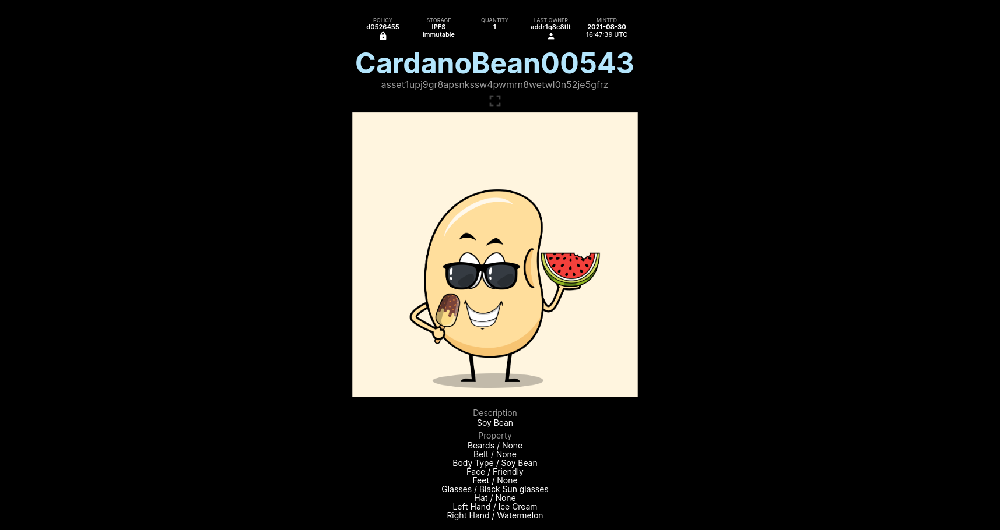

Next up we have fungible tokens. These tokens could be compared to a currency like euro for example.
It displays some sort of value within it's metadata, but this token is actually able to be split up.
Just like money 10 euro is the same value as 2 x 5 euro, it works the same for this fungible token.

Fungible tokens could be used in games to represent some sort of value for example 'gems' in Clash of clans.
It could also be something like pokeballs in Pokemon Go which you could then trade using the blockchain.
It could also be used as a digital form of having festival coins. Below is an example of a fungible token:

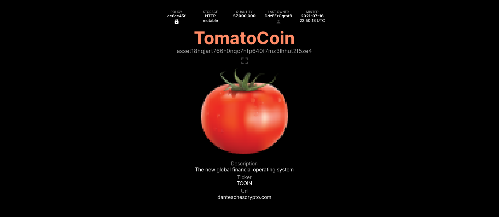

**Note: these two example images are randomly selected from the Cardano blockchain and are not for promoting purposes.**

**TASK:** Now let's try and mint a NFT yourself. Go over to [Mesh](https://meshjs.dev/apis/transaction/minting)
and mint your own digital asset.

Be creative and adjust the metadata of your token, later on in the course we will add our own image to this.
For now use the standard one that is included. After waiting for a bit you should have received your NFT in your wallet. It should look like this:

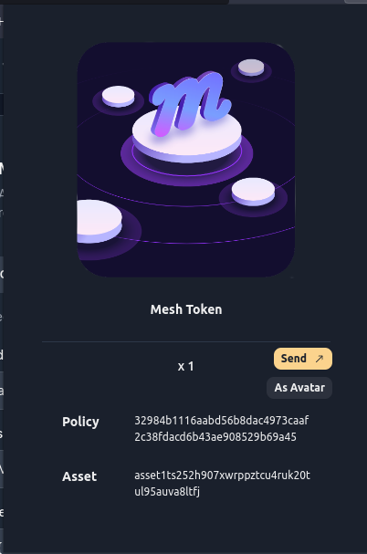

**Sources:**

* https://www.coinbase.com/learn/crypto-basics/what-is-a-token
* https://developers.cardano.org/docs/native-tokens/
* https://meshjs.dev/apis/transaction/minting

# Comparing HTTP model to IPFS

Since blockchain is a decentralized way of making consensus with other party's without trusting each other.
It is also important how the web can be decentralized. Currently the client-server model dominates over peer-to-peer,
because clients do not have to 'pay' for services from big tech companies. Since servers function like a middlemen, 
we want to know how to avoid these servers to share data accross the web without the risk of being limited, because of no access to a server.
Down below HTTP and IPFS will be discussed with its benefits and disadvantages.

## HTTP

We all know about **HTTP** (HyperText Transfer Protocol), 
it is the standard as it comes to transferring data from a server to a client and the other way around.
The client-server model is a centralized manner of sharing data across the web. When we take a look at the diagram below,
you can see that only one computer (server) is connected to all clients. Since the server contains all the data,
it means that the person who maintains the server can decide whether you can access it or not.

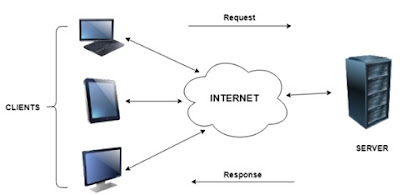

This model has it's advantages but also some disadvantages, they will be summed up below:

**Advantages:**

* Data protection is 'easy'
* Centralized -> easy to maintain
* Scalable 

**Disadvantages:**

* Centralized, one party owns it all
* When server is down, no access to data
* Most servers collect user data in exchange for their service
* vulnerable for DOS (Denial of service) attacks 

## IPFS

IPFS (interplanetary file system) is a peer-to-peer (decentralized) system that cuts out the middlemen (big servers).
Just like with blockchain the IPFS network exists of multiple nodes that all could function like a server.
The nodes are all connected to each other, see diagram below.

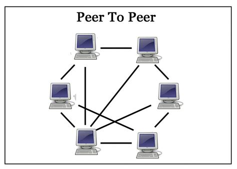

The client-server system works based on URL's (Uniform Resource Locator). The URL specifically asks for data stored on a location on the webserver.
With IPFS this works differently.

Data on the IPFS network is stored in objects that have a maximum size of 256 kilo bytes.
Whenever the data is greater than this, then the data gets split up in multiple objects.
1 object links all the objects together and the other objects will contain all the data:

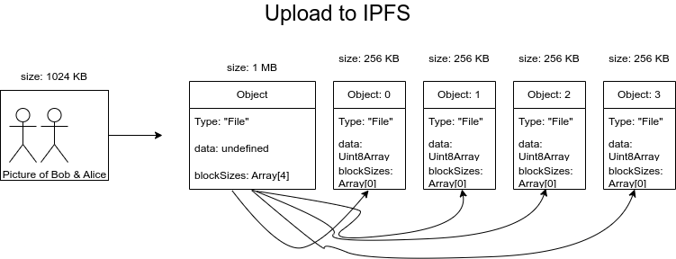

Next to this each object gets a unique hash. Based on this hash the object gets a CID (content indentifier).
So whenever you want to lookup data on the network, you do not use an URL. Instead you would propagate to the network
"who has this CID for me?" Then the node that has the CID will send it to you.

Is it save? Each object has it's own hash. whenever someone would change the data that belongs to the CID,
The hash will change and then you know it is not original data anymore.

When you upload some data on your IPFS node, other nodes are taking copies in their cache (temporary memory),
but it also could be that a node downloads the file. This process is for scaling the network speed.
When this happens multiple nodes are able to provide data over the network. This is different than from the
client-server model that has all the data stored in one place.

### sources:
* https://www.geeksforgeeks.org/difference-between-http-and-ipfs/
* https://onlinesmarttrainer.blogspot.com/2020/02/clientserver-model.html
* https://www.geeksforgeeks.org/client-server-model/
* https://ipfs.tech/#how
* https://docs.ipfs.tech/concepts/content-addressing/


## TASK: Install and use IPFS

First follow the [download instructions](https://docs.ipfs.tech/install/ipfs-desktop/#windows).

When using linux use the following instructions:

```
git clone https://github.com/ipfs/ipfs-desktop.git
cd ipfs-desktop
npm ci
npm run build
npm start
```

1. After installing we can upload some data! Carefully look for an image that you want to upload,
make sure it does not have any sensitive content in it. (when uploaded to the network everyone is able to take a copy!) Try out an image that is lager than 256 KB.

2. Next start your IPFS node and go to the files page.

3. Click on import and select your image.

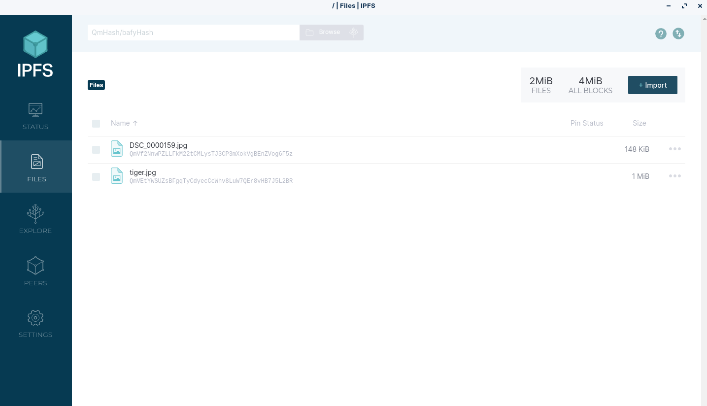

When the file is added we can take a look at the details of it.
click on the 3 dots next to the size of the file you have uploaded. You will now see something like this:

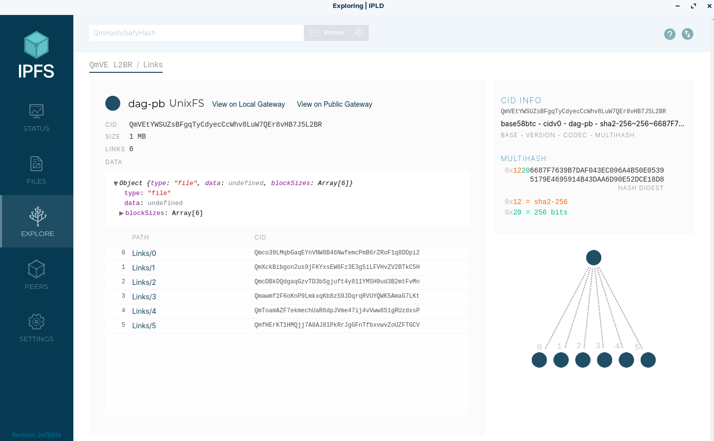

Here you can see the object that links all the other objects together. As you can see,
the linking object does not contain any data, but the blockSizes parameter has an array of 6 objects.
those are listed down below:

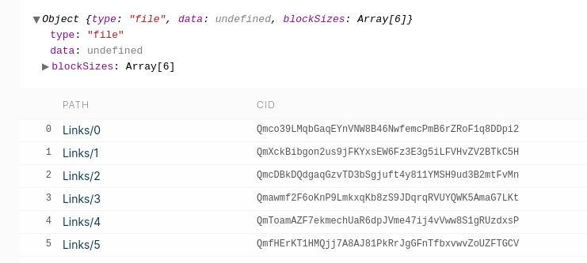

## Mint your own NFT!

To mint your own NFT we will need to include the CID of your image in the metadata.

The CID can be copied like this:

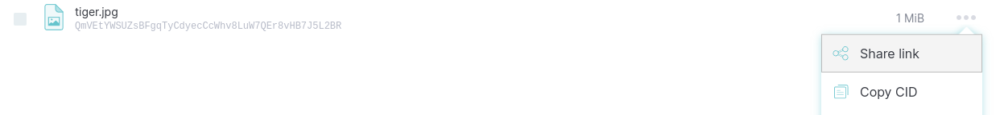

Ofcourse you could go back to the mesh website and include your CID in your metadata.
We are going to mint this from our Dapp.

**Step 1: Add another textfield**

Include a new textfield for the user to put in a CID. It will look like this:


**Step 2: Store the state of the textfield:**

Remember how you stored the textfields of the wallet address and the amount of ada?
This proces of storing the CID is exactly the same! see if you can figure out yourself!

**Step 3: make a standard format for your metadata**

Make a constant of type AssetMetadata like this:

```
 // metadata only used as example
  const metadata: AssetMetadata={
    "name": "Mesh Token",
    "image": "ipfs://QmRzicpReutwCkM6aotuKjErFCUD213DpwPq6ByuzMJaua",
    "mediaType": "image/jpg",
    "description": "This NFT is minted by Mesh (https://meshjs.dev/)."
  };
```

**Step 4: Include CID in the build function:**


```
import { Transaction, ForgeScript } from '@meshsdk/core';
import type { Mint, AssetMetadata } from '@meshsdk/core';

/ Build transaction, includes : wallet address, amount of money, metadata & start time of tx. (metadata & exptime optional) (returns a type 'Transaction' )
  async function buildTx(walletAdr: string, amount: string, metadata?: any, CID?: AssetMetadata, startSlot?: string): Promise<string>{
    const tx = new Transaction({ initiator: wallet })
    .sendLovelace(
      walletAdr,
      amount
    );

    if(metadata && CID){
      const forgingScript = ForgeScript.withOneSignature(walletAdr);
      //metadata.image = CID;
      const asset: Mint = {
        assetName: 'MeshToken', //could be named differently/ let user decide name of nft.
        assetQuantity: '1', // amount is 1, because of nft purpose.
        metadata: metadata,
        label: '721', // label used by Mesh as indicator for nft
        recipient: walletAdr,
      };
      tx.mintAsset(
        forgingScript,
        asset
      );
      console.log("tx mint");
    }else if(metadata){
      tx.setMetadata(0, metadata);
    }else{
      console.log("no metadata");
    }
    */
    const unsignedTx = await tx.build();
    return unsignedTx;
  }
```

**Step 5: Implement CID in build button:**

```
<button
          type="button"
          onClick={() => setCurrentTx(buildTx(WalletAddress, adaToLovelace(txAmount), metadata, txCID))}
          disabled={loading}
          style={{
            margin: "18px",
            backgroundColor: loading ? "orange" : "grey",
          }}
        >
          Build TX
        </button>
```

When implemented everything launch your Dapp with **npm run dev** and fill in your CID to mint a NFT.

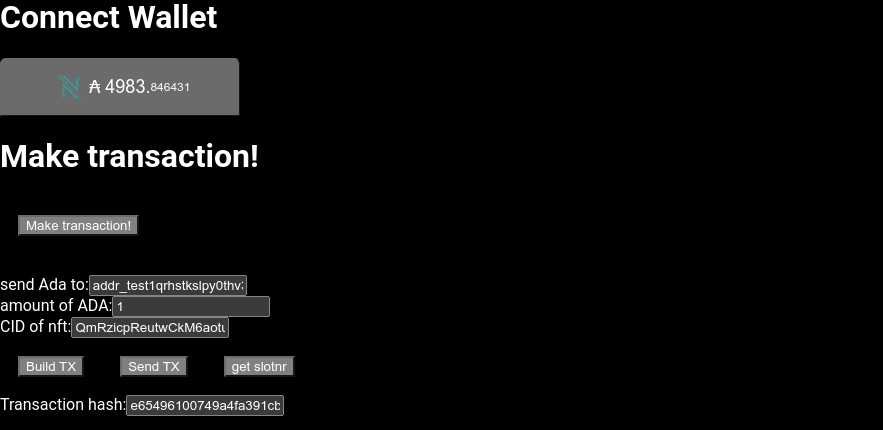

The output of the transaction should look like [this](https://preprod.cardanoscan.io/transaction/e65496100749a4fa391cbc6a5ac7d3f55b677dda81339950f58890e7cfc954ce)

After finishing this course you should be able to:

* explain what tokens are
* know the difference between a centralized and decentralized web (ifps/ http)
* implement minting function from Mesh in your dapp


