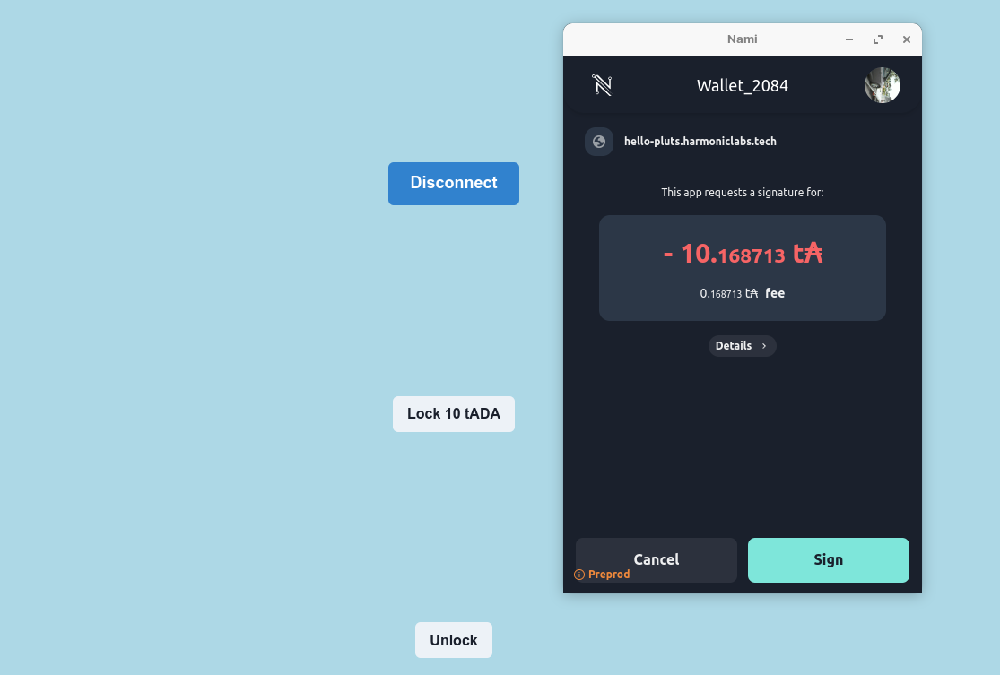
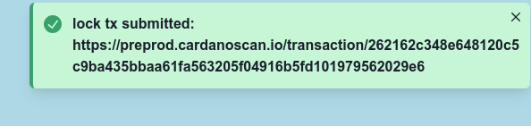
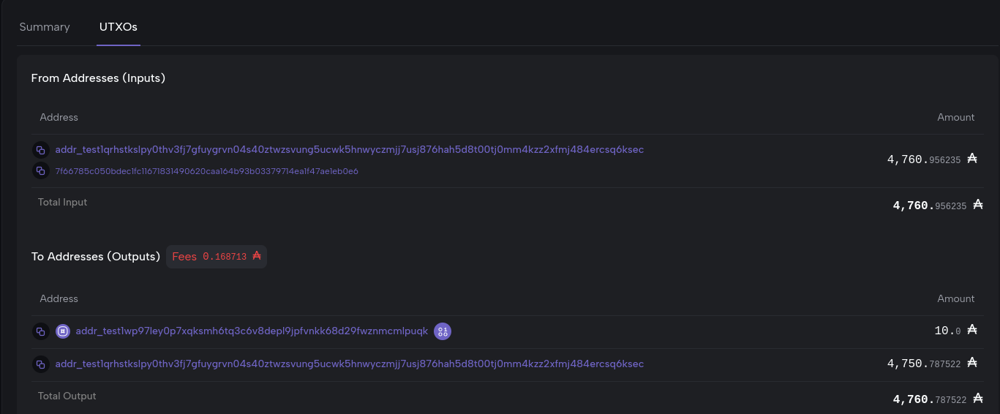
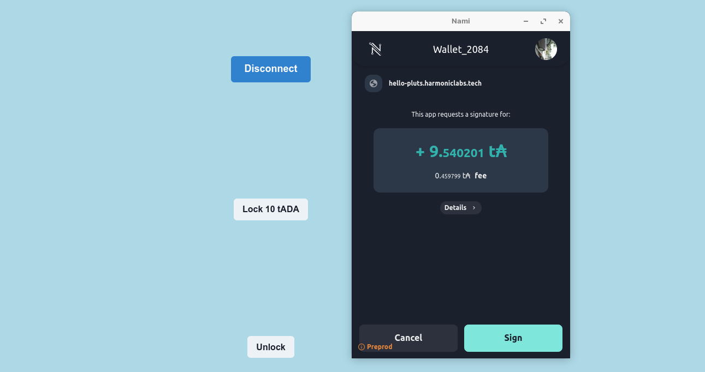
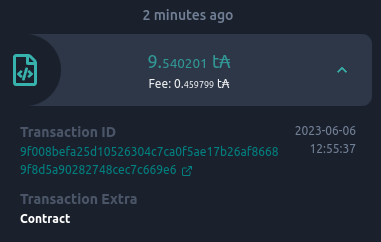
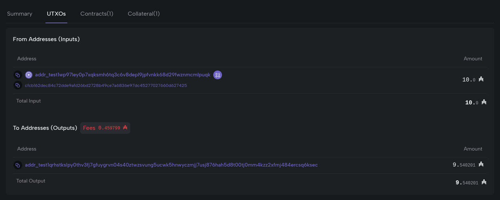
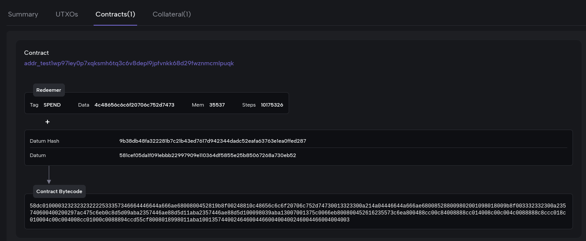
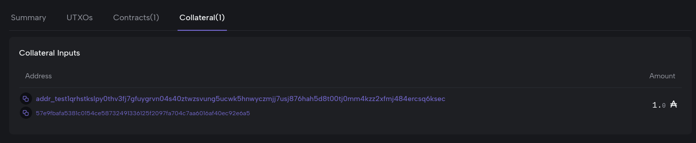

# HvA Cardano practicum 5

## Learning objectives

* Explain what a smart contract does
* Explain its use cases
* Know how locking tokens work
* Interact with a smart contract in your Dapp

## Prerequisites

* week4 finished

# What is a smart contract

Smart contracts are programs/ scripts that are stored on the blockchain. Whenever someone interacts with it,
the script will check it's inputs and checks if predetermined conditions are met. The result of the script will either be 'true' or 'false'.
They are used for automating agreements without having a 3th party.

To program smart contracts a domain specific language is developed called Plutus. This is based on a functional programming language named Haskell.
Since Haskell is a hard to learn programming language plu-ts (Plutus typescript) is designed to make life easier for progammers.
We will implement the usage of a plu-ts smart contract later on in this practicum.

To understand the working of a smart contract on the Cardano blockchain there are a few terms that need some explanation:

* **Plutus script:** This is the program/ script that contains the logic (if, else, when etc.) that can verify if conditions are met. It always returns a true or a false.
This script

* **Script address:** is the hash of the plutus script. They hold UTXO's just like regular 'wallets'.
Everytime someone wants to spend it's UTXO's the script is executed by a validator node and checks if inputs are valid.

* **Datum:** The datum is some extra info associated with a UTXO. Whenever UTXO's are send to a script to get locked into it,
the hash of the datum is included. Whenever someone wants to spend the locked UTXO's in the script, the correct datum should be included.
The hash of the datum has to match the hash of the datum of the locked UTXO's

* **Redeemer:** The redeemer has a redeemer in it and some extra data. It includes data about what to do with UTXO's when they get unlocked.
This redeemer includes also the data that is needed by the plutus script to actually unlock the funds.

* **Script context:** The script context provides information about the pending transaction, along with which input triggered the validation.

**Example video:**

In this video an example of an auction is explained by one of the professionals of Input output global.
Watch this [video](https://youtu.be/Bj6bqRGT1L0) till 7:27 

## usecase's of smartcontracts

As we now know, smart contracts are used to either lock or unlock funds. The conditions that need to be met for unlocking funds can vary.
Here are some examples:

* **auction contract:** use a script that checks who has the highest bid and make lower bids return to their original wallet.
Whenever the owner of the asset agrees with the bid the contract will send the asset to the bidder and the bid to the old owner of the asset.

* **Lending:** lock some collateral in a contract in exchange for some liquidity. For example Lock your 6k NFT in exchange for 6k of stable coins. If not payed back in time the NFT gets send to the lender.

* **Validate ownership:** Smart contracts can check if a wallet is the owner of some asset. Let's
say you have a digital identity that proofs that you are 18 years or older. With this check you could
get provided access to certain type of adult websites.

**TASK:** Ask ChatGPT for a plutus script example and a plutus core example.

## sources:
* https://www.ibm.com/topics/smart-contracts
* https://pycardano.readthedocs.io/en/latest/guides/plutus.html
* https://docs.cardano.org/plutus/learn-about-plutus/
* https://cardano.stackexchange.com/questions/4902/how-do-i-read-the-datum-of-an-output
* https://youtu.be/Bj6bqRGT1L0

# How are tokens locked/ unlocked

Above we discussed what smart contracts are and what it's usecases are. Now we have a deeper look into how they are build up.
We will interact with a simple smart contract that only locks and unlocks tokens. Follow the next steps:

* **Step 1:** Go to this [test website](https://hello-pluts.harmoniclabs.tech/) and connect your wallet.
* **Step 2:** Click on Lock 10 tADA and lock 10 tADA:

* **Step 3:** go over to the link in the popup that you will see after signing the transaction:

After a while you will see something like this:

from your address you send 10 tADA to the script address that is : addr_test1wp97ley0p7xqksmh6tq3c6v8depl9jpfvnkk68d29fwznmcmlpuqk

* **Step 4:** go back to the [test website](https://hello-pluts.harmoniclabs.tech/) and click unlock:

Sign the transaction. Again go over to the link in the popup. (Note you could also go over to your last transaction and click on the transaction id)

When unlocking the tADA from the contract something extra's happens. It is not only transferring tADA from the script address to yours,
it also shows you some more info. As you can see in the images below the ada is back to your wallet. When you look at 'contracts'
you can see a couple of things. 

First of you can see the contract/ script address. Next you see this 'redeemer' with some data that tells you what kind of redeemer it is.
In this case the tag is SPEND, because when we unlocked the tADA we requested the smart contract to spend it's ada to our wallet.
The 'mem' is the budget in memory that is needed to run the script. And the 'steps' are the amount of cpu steps it needs to do.

In the last image you see 'collateral' This is just 1 tADA. This 1 tADA is the minimum you need to spend.
The input of this 1tADA will be returned to your address.

After finishing this course you should be able to:

* Tell what a smart contract is.
* know how to interact and read it's outputs.
* implement the lock/ unlock script in your dapp

